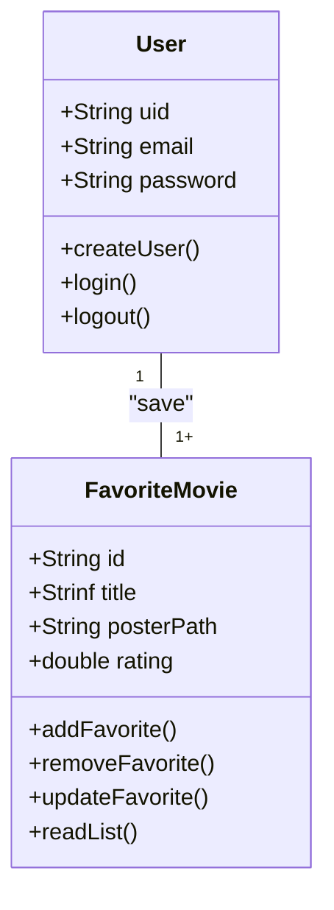
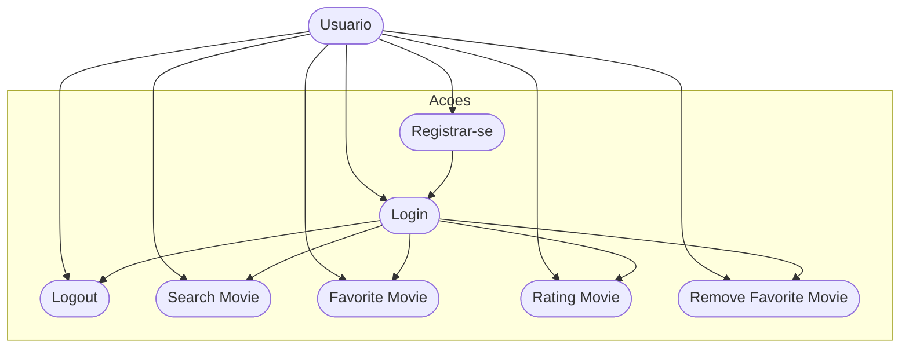
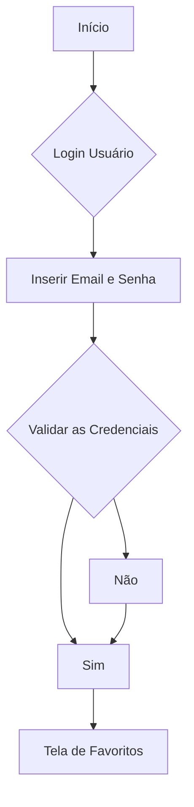

# CineFavorite - Formativa
Construir um Aplicativo do Zero - O CineFavorite permitirá criar uma conta e buscar filmes em uma API e montar uma galeria pessoal de filmes favoritos, com posters e notas.

## Objetivos 
- Criar uma galeria personalizada por usuário de filmes favoritos
- Conectar o APP com uma API(base de dados) de filmes
- Permitir a criação de contas para cada usuário 
- Buscar filmes por palavra chave  

## Levantamento de Requisitos do Projeto
- ## Funcionais

- ## Não Funcionais

## Recursos do Projeto
- Fluter/Dart
- Firebase(Authentication/Firestore Database)
- API TMDB
- Figma

## Diagramas 

1. ### Classes 
    Demonstrar o funcionamento das entidades do sistema
    - Usuario(User): classe já modelada pelo FirebaseAuth
        - Email  
        - Password 
        - uid
        - login()
        - logout()
        - create()
    - FilmeFavorito: Classe modelada pelo DEV
        - number:id
        - String:titulo
        - String:poster
        - Double:rating
        - adicionar()
        - remover()
        - listar()
        - updateNota()

2. ### Uso
    Ações que os atores podem fazer
    - User: 
        - Registrar
        - Login
        - Logout
        - Procurar Filmes API
        - Salvar Filmes Favoritos
        - Dar Nota aos Filmes
        - Remover Favoritos

3. ### Fluxo 
    Determina o caminho percorrido pelo ator para executar uma ação
    - Ação de Login

## Prototipagem 
- ## Figma: https://www.figma.com/design/RaVrlpiggF1y6KsHnla12U/Untitled?t=BT6b5NIQQkaFseV9-1

## Codificação